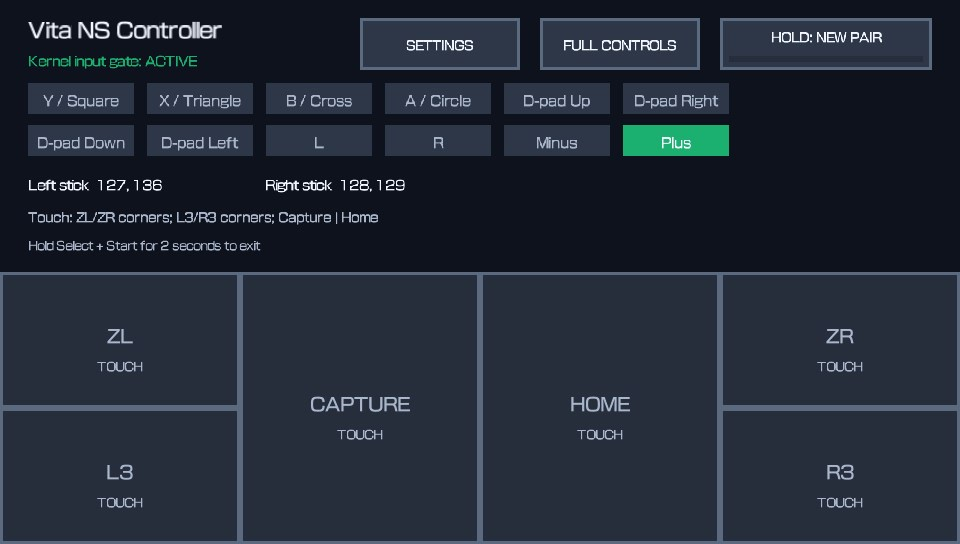

# Vita NS Controller

[English](#english) · [简体中文](#简体中文) · [日本語](#日本語)

## Screenshot

Add the main interface screenshot later at the reserved path below; the README
will display it automatically.



<a id="english"></a>

## English

Vita NS Controller turns a hacked PlayStation Vita into a Bluetooth controller
for Nintendo Switch. It communicates directly through the Vita's built-in
Bluetooth hardware; no Linux relay and no modified Switch are required.

> [!WARNING]
> This is experimental kernel software. The current plugin contains offsets for
> **PS Vita system software 3.60 only**. Do not load it on another firmware.

### Features and limitations

- Initial registration through the Switch **Change Grip/Order** screen.
- Input-triggered reconnect from a normal Switch system or game screen.
- Physical buttons, D-pad, both sticks, shoulder buttons, Plus and Minus.
- Touch controls for ZL, ZR, L3, R3, Capture, and Home.
- Independent L/ZL and R/ZR mapping options.
- The Vita application must remain in the foreground.
- Motion/gyroscope forwarding is not currently enabled.
- Hardware-tested on a PS Vita running 3.60 and a Nintendo Switch 2.

### Installation

Requirements: a hacked PS Vita on firmware 3.60 with taiHEN, VitaShell, and a
Nintendo Switch or Switch 2.

1. Copy `vita_ns_controller.skprx` to `ur0:tai/`.
2. Add it at the end of the existing `*KERNEL` section in
   `ur0:tai/config.txt`:

   ```text
   *KERNEL
   ur0:tai/vita_ns_controller.skprx
   ```

3. Install `vita_ns_controller.vpk` with VitaShell.
4. Reboot the Vita.
5. Launch **Vita NS Controller** from LiveArea.

When upgrading from an earlier development build, remove the old
`ur0:tai/scebt_probe.skprx` entry. Never load both plugin filenames at once.
If a plugin boot loop occurs, hold **L** while the Vita starts to skip taiHEN
plugins, then remove the plugin entry.

### Usage

For first registration:

1. Launch the Vita application and keep it in the foreground.
2. On Switch, open **Controllers → Change Grip/Order**.
3. On Vita, hold **HOLD: NEW PAIR** until the progress bar completes.
4. Wait for the Pro Controller to appear.

For later reconnects, launch or return to the Vita application, wake the
Switch, and press one Vita button or touch one mapped control. The plugin
remains silent until an input edge occurs. If the stored registration is no
longer valid, repeat the first-registration procedure.

| PS Vita | Nintendo Switch |
|---|---|
| Square / Triangle / Cross / Circle | Y / X / B / A |
| D-pad | D-pad |
| Left and right analog sticks | Left and right sticks |
| L / R | L / R |
| Select / Start | Minus / Plus |
| Touch zones | ZL, ZR, L3, R3, Capture, Home |

Use **FULL CONTROLS** for the large touch layout. In **SETTINGS**, L/ZL and
R/ZR can be swapped independently; the UI labels follow the selected mapping.
Hold **Select + Start** for two seconds to exit.

### Building

Install VitaSDK and vita2d, then run:

```sh
cmake -S . -B build
cmake --build build

cmake -S controller_app -B build-controller-app
cmake --build build-controller-app
```

Release files:

```text
build/vita_ns_controller.skprx
build-controller-app/vita_ns_controller.vpk
```

Run `python3 tools/generate_livearea_assets.py` to regenerate the deterministic
indexed LiveArea PNG files.

### Troubleshooting

- **Kernel input gate: ERROR:** check the kernel plugin path and reboot.
- **Old icon or LiveArea art:** close the LiveArea page and reboot once after
  installing the updated VPK; SceShell may retain content for the same Title ID.
- **Reconnect fails:** keep the Vita application in the foreground and send one
  Vita input after the Switch is awake.
- **Wi-Fi or FTP becomes unstable:** stop the controller application before
  transferring files. Vita Wi-Fi and Bluetooth share hardware/firmware paths.

<a id="简体中文"></a>

## 简体中文

Vita NS Controller 可以让已破解的 PlayStation Vita 通过内置蓝牙直接模拟
Nintendo Switch 手柄，不需要 Linux 中继，也不要求破解 Switch。

> [!WARNING]
> 本项目包含实验性内核插件。当前插件使用 **PS Vita 3.60 固件专用偏移**，
> 请勿在其他系统版本上加载。

### 功能与限制

- 可在 Switch 的“更改握法/顺序”页面完成首次登记。
- 登记后可在 Switch 普通系统或游戏画面通过 Vita 输入触发重连。
- 转发实体按键、方向键、双摇杆、肩键、Plus 和 Minus。
- 通过触屏提供 ZL、ZR、L3、R3、截图键和 HOME 键。
- L/ZL 与 R/ZR 可分别交换映射。
- Vita 应用必须保持在前台。
- 当前没有启用陀螺仪/体感数据转发。
- 已在 3.60 系统的 PS Vita 与 Nintendo Switch 2 上完成实机验证。

### 安装

需要：运行 3.60 系统且已启用 taiHEN 的 PS Vita、VitaShell，以及 Nintendo
Switch 或 Switch 2。

1. 将 `vita_ns_controller.skprx` 复制到 `ur0:tai/`。
2. 在 `ur0:tai/config.txt` 现有的 `*KERNEL` 段末尾加入：

   ```text
   *KERNEL
   ur0:tai/vita_ns_controller.skprx
   ```

3. 使用 VitaShell 安装 `vita_ns_controller.vpk`。
4. 重启 Vita。
5. 从 LiveArea 启动 **Vita NS Controller**。

从早期开发版升级时，请删除旧的
`ur0:tai/scebt_probe.skprx` 配置项，不能同时加载两个文件名。若插件导致
开机循环，可在 Vita 启动时一直按住 **L** 跳过 taiHEN 插件，再删除配置项。

### 使用

首次登记：

1. 启动 Vita 应用并保持在前台。
2. 在 Switch 打开“控制器 → 更改握法/顺序”。
3. 在 Vita 上长按 **HOLD: NEW PAIR**，直到进度条走完。
4. 等待 Pro Controller 出现在 Switch 上。

之后重连时，启动或切回 Vita 应用，唤醒 Switch，然后按一次 Vita 实体键或
触摸一个映射区域。没有 Vita 输入时插件会保持静默。如果原有登记已经失效，
请重新执行首次登记流程。

| PS Vita | Nintendo Switch |
|---|---|
| 方块 / 三角 / 叉 / 圆圈 | Y / X / B / A |
| 方向键 | 方向键 |
| 左右摇杆 | 左右摇杆 |
| L / R | L / R |
| Select / Start | Minus / Plus |
| 触屏区域 | ZL、ZR、L3、R3、截图、HOME |

点击 **FULL CONTROLS** 可切换到大面积触摸布局。在 **SETTINGS** 中可以分别
交换 L/ZL 和 R/ZR，界面标签会同步变化。长按 **Select + Start** 两秒退出。

### 构建

安装 VitaSDK 和 vita2d 后运行：

```sh
cmake -S . -B build
cmake --build build

cmake -S controller_app -B build-controller-app
cmake --build build-controller-app
```

发布文件位于：

```text
build/vita_ns_controller.skprx
build-controller-app/vita_ns_controller.vpk
```

运行 `python3 tools/generate_livearea_assets.py` 可重新生成确定性的索引 PNG
LiveArea 资源。

### 故障排查

- **显示 Kernel input gate: ERROR：**检查内核插件路径并重启。
- **仍显示旧图标或 LiveArea 图片：**安装新 VPK 后退出 LiveArea 页面并重启
  一次；SceShell 可能缓存相同 Title ID 的旧资源。
- **无法重连：**确保 Vita 应用位于前台，并在 Switch 唤醒后产生一次 Vita 输入。
- **Wi-Fi 或 FTP 不稳定：**传输文件前先退出手柄应用；Vita 的 Wi-Fi 和蓝牙
  共享部分硬件及固件路径。

<a id="日本語"></a>

## 日本語

Vita NS Controller は、改造済み PlayStation Vita を Nintendo Switch 用の
Bluetooth コントローラーとして動作させます。Vita 内蔵 Bluetooth と直接通信
するため、Linux 中継機や改造済み Switch は不要です。

> [!WARNING]
> 本プロジェクトは実験的なカーネルプラグインを使用します。現在のプラグイン
> は **PS Vita システムソフトウェア 3.60 専用のオフセット**を含みます。
> ほかのバージョンでは読み込まないでください。

### 機能と制限

- Switch の「持ちかた/順番を変える」画面から初回登録できます。
- 登録後は、通常のシステム画面やゲーム画面から Vita の入力で再接続できます。
- 物理ボタン、方向キー、左右スティック、ショルダーボタン、Plus、Minus に対応。
- タッチ操作で ZL、ZR、L3、R3、キャプチャー、HOME を入力できます。
- L/ZL と R/ZR の割り当てを個別に入れ替えられます。
- Vita アプリをフォアグラウンドで実行しておく必要があります。
- モーション/ジャイロ転送は現在無効です。
- システムソフトウェア 3.60 の PS Vita と Nintendo Switch 2 で実機確認済みです。

### インストール

必要なもの：taiHEN を導入したシステムソフトウェア 3.60 の PS Vita、
VitaShell、Nintendo Switch または Switch 2。

1. `vita_ns_controller.skprx` を `ur0:tai/` にコピーします。
2. `ur0:tai/config.txt` の既存の `*KERNEL` セクション末尾に追加します。

   ```text
   *KERNEL
   ur0:tai/vita_ns_controller.skprx
   ```

3. VitaShell で `vita_ns_controller.vpk` をインストールします。
4. Vita を再起動します。
5. LiveArea から **Vita NS Controller** を起動します。

以前の開発版から更新する場合は、古い
`ur0:tai/scebt_probe.skprx` の行を削除してください。2つのファイル名を
同時に読み込まないでください。起動ループが発生した場合は、Vita の起動中に
**L** を押し続けて taiHEN プラグインをスキップし、設定行を削除します。

### 使い方

初回登録：

1. Vita アプリを起動し、フォアグラウンドのままにします。
2. Switch で「コントローラー → 持ちかた/順番を変える」を開きます。
3. Vita の **HOLD: NEW PAIR** を進捗バーが完了するまで長押しします。
4. Switch に Pro Controller が表示されるまで待ちます。

2回目以降は Vita アプリを起動または前面に戻し、Switch を起動してから Vita の
物理ボタン、または割り当て済みタッチ領域を1回入力します。Vita の入力がない間、
プラグインは通信を開始しません。登録情報が無効になった場合は初回登録を
やり直してください。

| PS Vita | Nintendo Switch |
|---|---|
| □ / △ / × / ○ | Y / X / B / A |
| 方向キー | 方向キー |
| 左右アナログスティック | 左右スティック |
| L / R | L / R |
| Select / Start | Minus / Plus |
| タッチ領域 | ZL、ZR、L3、R3、キャプチャー、HOME |

**FULL CONTROLS** で大きなタッチレイアウトへ切り替えられます。
**SETTINGS** では L/ZL と R/ZR を個別に入れ替えられ、画面表示も設定に
追従します。終了するには **Select + Start** を2秒間長押しします。

### ビルド

VitaSDK と vita2d をインストールしてから実行します。

```sh
cmake -S . -B build
cmake --build build

cmake -S controller_app -B build-controller-app
cmake --build build-controller-app
```

生成物：

```text
build/vita_ns_controller.skprx
build-controller-app/vita_ns_controller.vpk
```

`python3 tools/generate_livearea_assets.py` を実行すると、LiveArea 用の
インデックス PNG を同じ内容で再生成できます。

### トラブルシューティング

- **Kernel input gate: ERROR：**カーネルプラグインのパスを確認して再起動します。
- **古いアイコン/LiveArea 画像が残る：**新しい VPK のインストール後に
  LiveArea を閉じ、Vita を一度再起動します。同じ Title ID の内容が SceShell
  にキャッシュされる場合があります。
- **再接続できない：**Vita アプリを前面に置き、Switch の起動後に Vita から
  1回入力してください。
- **Wi-Fi/FTP が不安定：**ファイル転送前にコントローラーアプリを終了します。
  Vita の Wi-Fi と Bluetooth は一部のハードウェア/ファームウェア経路を共有します。

## Credits

- [VitaSDK](https://vitasdk.org/) and
  [taiHEN](https://github.com/yifanlu/taiHEN) provide the Vita toolchain,
  SDK, and plugin framework.
- [vita2dlib](https://github.com/xerpi/vita2dlib) is used by the controller
  application's UI.
- [Nintendo Switch Reverse Engineering](https://github.com/dekuNukem/Nintendo_Switch_Reverse_Engineering),
  [joycontrol](https://github.com/mart1nro/joycontrol), and
  [NXBT](https://github.com/Brikwerk/nxbt) were invaluable protocol and
  reconnect references.
- The Bluetooth HID report descriptor is derived from
  [retro-pico-switch](https://github.com/DavidPagels/retro-pico-switch)
  by David Pagels and is covered by its MIT license.
- Protocol and calibration data are derived in part from the MIT-licensed
  [esp-usb-ble-hid](https://github.com/finger563/esp-usb-ble-hid)
  implementation by esp-cpp.
- [VitaCompanion](https://github.com/devnoname120/vitacompanion) was used for
  development and repeatable hardware testing.

The complete third-party license notice is included in
[`THIRD_PARTY_NOTICES.md`](THIRD_PARTY_NOTICES.md).

The joycontrol GPL-3.0 project and the dekuNukem reverse-engineering notes are
interoperability references only; their source code and repository assets are
not redistributed by this project.

## License

Vita NS Controller is released under the [MIT License](LICENSE). Third-party
portions remain covered by the licenses and copyright notices listed in
[`THIRD_PARTY_NOTICES.md`](THIRD_PARTY_NOTICES.md).
